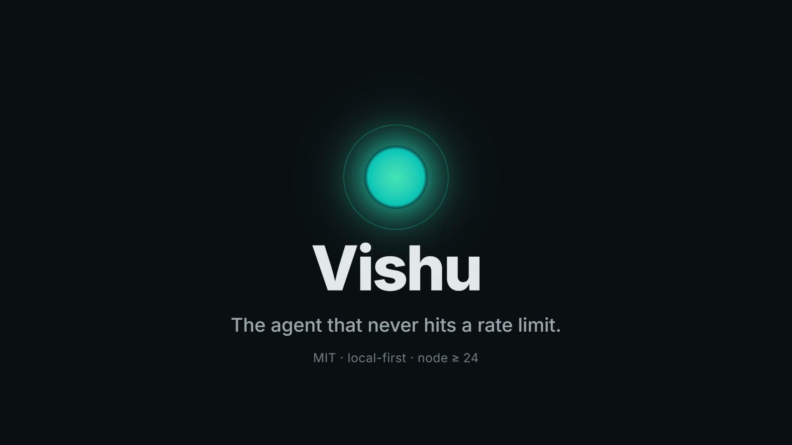

<div align="center">
  
  <h1>Vishu</h1>
  <p><strong>A local-first personal-assistant AI that never hits a rate limit.</strong></p>
  <p>Pool every provider key you have — plus your laptop's own model — into one ring. One 429 and it fails over to the next. Vision, voice, memory, and a two-way MCP gateway make it do real work; coding and job-hunting are just two of the things it does.</p>
  <p>
    
    
    
  </p>
  <p>
    <a href="brag-output/brag.mp4"></a><br/>
    <sub><a href="brag-output/brag.mp4">▶ Watch the 20-second tour</a></sub>
  </p>
</div>

---

## What Vishu is

Vishu is a **personal-assistant AI you run yourself**. Talk to it, hand it a task, and it delivers finished work — gating anything consequential behind your approval. It sees images, listens and speaks, remembers in plain markdown you own, and connects to any app through MCP. Writing code and applying to jobs are *capabilities*, not the product.

The one thing it refuses to do is stall on a rate limit.

## The wedge: it never hits a rate limit

Every other agent is married to one vendor. Hit the limit and you wait, pay for a higher tier, or stop. Vishu treats your providers as a **pool**: paste the keys you already have — Anthropic, OpenAI, a Gemini free tier, Groq, a local Ollama — and it routes across them.

```bash
VISHU_API_KEYS=sk-ant-…,sk-…,gsk_…   VISHU_KEY_MODE=balance
```

- **`failover`** — run on one key, rotate to the next only on quota/limit/5xx. Backup keys = no walls.
- **`balance`** — round-robin every call, so a multi-agent burst spreads across keys instead of hammering one 429.
- **`local`** — prefer a local LLM when present; fold it in with `VISHU_LOCAL_BASE_URL=http://127.0.0.1:11434`.

**Proof, not a slogan.** A burst of 40 concurrent calls against keys that 429 past their quota — a single client (one key, the shape every other agent ships) vs. Vishu's ring:

| Runner | Completed under the burst |
|---|---|
| single client (no ring) | 10 / 40 — stalls the moment the key throttles |
| Vishu `failover` | **40 / 40** — rotates off each 429 through the ring |
| Vishu `balance` | **40 / 40** — spreads the burst across keys |

Deterministic, no keys or network required: `npx tsx packages/core/src/reliability/ratelimit-bench.ts`.

## What it can do

- **Local model, offline.** GPU-offloaded IPEX-LLM Ollama on an Intel Arc iGPU — the local model is just another key in the ring, no cloud required.
- **Live vision.** Point `see_image` at a picture and a local vision model (moondream) describes it — verified working fully offline.
- **Voice.** Streaming STT (whisper.cpp) + TTS (Piper) with barge-in, behind the `voice` module.
- **Bidirectional MCP gateway.** Vishu is both an MCP *client* (mount any server) and an MCP *server* (`vishu mcp-serve` re-exposes it to other agents). `vishu connect <app>` mounts a new capability in one command (see below).
- **Memory you own.** A plaintext, Obsidian-editable markdown vault is the source of truth; the SQLite vector/FTS index is derived and rebuildable. Edit a note by hand, delete the index — nothing is locked in a proprietary store.
- **Software it verifies, not vibes.** `vishu build` runs a spec interview → your approval → a chunked multi-agent build → a **deterministic** OWASP Top-10 scan → a maintainability gate. Security gates on a real scanner, **never** on an LLM grading its own work.

## Quickstart

**Windows — one click:**

```powershell
./install.ps1     # checks Node ≥ 24, provisions pnpm, installs, builds, writes .env
```

**Any OS:**

```bash
node setup.mjs            # or: npm run setup — provisions pnpm via corepack
cp .env.example .env      # paste a key into VISHU_API_KEY
```

```bash
pnpm vishu chat  "explain this repo"
pnpm vishu agent "add a /health endpoint and a test for it"
pnpm vishu build "a todo app with auth"      # guided secure build
```

> Windows PowerShell sets env vars with `$env:VISHU_API_KEY="…"`, not `export`.

### Connect an app

Everything Vishu touches beyond your keys is an MCP mount. Add one in a command:

```bash
pnpm vishu connect github        # a known MCP by name
pnpm vishu connect gmail         # any app name → routed through Composio (1000+ apps, one key)
pnpm vishu connect gmail --auth  # turnkey: opens the OAuth link, waits until it's connected
pnpm vishu connect foo --cmd "npx -y some-mcp-server"   # a custom stdio server
pnpm vishu mcp-serve             # expose Vishu itself as an MCP to other agents
```

### Just paste a key — the provider is auto-detected

Leave `VISHU_PROVIDER` unset and Vishu reads the provider off the key prefix:

| Prefix | Provider | | Prefix | Provider |
|---|---|---|---|---|
| `sk-ant-…` | Anthropic | | `sk-or-…` | OpenRouter |
| `nvapi-…` | NVIDIA NIM | | `fw_…` | Fireworks |
| `AIza…` | Google Gemini | | `xai-…` | xAI (Grok) |
| `gsk_…` | Groq | | `sk-…` | OpenAI |

Standard vars work too (`OPENAI_API_KEY`, `ANTHROPIC_API_KEY`, `GEMINI_API_KEY`, …), and any key var accepts a comma-separated list for failover. Different providers in parallel? Declare them in `~/.vishu/config.json`, each with its own model:

```json
{ "providers": {
    "claude": { "type": "anthropic", "apiKeys": ["sk-ant-…"], "model": "claude-opus-4-…" },
    "gpt":    { "type": "openai",    "apiKeys": ["sk-…"],     "model": "gpt-4o" },
    "local":  { "type": "ollama",    "baseUrl": "http://127.0.0.1:11434", "model": "llama3.2" }
} }
```

## What's inside

The agent has the tools you'd expect — `read/write/list`, `run_shell`, `web_fetch/search`, a persistent terminal, code-graph retrieval — all behind a `SecurityPolicy` (command classification, path jail, prompt-injection guard, sandbox backends). Around it: self-verification + git-worktree checkpoints/undo, risk-scoped approvals, a cost meter with a budget cap, the owned-markdown memory vault, the Arbor orchestration engine (hypothesis tree, subagents in isolated worktrees), test-time-compute amplifiers (`vishu eval` scores them), and an MCP client. Optional modules (wallet, voice, imagegen, desktop, …) stay off behind `VISHU_MODULES` and can't crash the core. A React/PWA frontend and a Rust/Tauri harness speak the same `vishu.*` JSON-RPC contract.

## Benchmarks

Honest and small for now: a built-in 8-task suite (4 easy + 4 hard) on **NVIDIA NIM `llama-3.1-8b-instruct`**.

| Runner | Pass rate | |
|---|---|---|
| `baseline` (single call) | 63% (5/8) | misses CRT bat-and-ball, two-leg distance, letter-count |
| `effort` (difficulty-routed) | 63% (5/8) | best-of-N fixes variance, not bias — ties baseline |
| `moa` (multi-agent ensemble) | **75% (6/8)** | **recovers two hard tasks single-shot misses** |

The lesson: self-consistency fixes variance, the multi-perspective ensemble fixes some bias. This is a reasoning probe, not a coding benchmark. For the real thing, `pnpm vishu eval swebench [--limit N]` runs the agent over **SWE-bench Lite** and writes a `predictions.jsonl`; scoring delegates to the official `swebench` harness (Docker + Python) rather than a homegrown scorer — the command prints the exact `run_evaluation` invocation when it finishes. Run the reasoning suite with `pnpm vishu eval <runner>` (`VISHU_EVAL_CONCURRENCY=1` on a single rate-limited key).

## Configuration

All config is file + `VISHU_*` env (see `.env.example`). The ones that matter:

| Var | Purpose |
|---|---|
| `VISHU_API_KEY` / `VISHU_API_KEYS` | provider key(s); a comma-list rotates or balances |
| `VISHU_KEY_MODE` | `failover` (default) / `balance` / `local` |
| `VISHU_PROVIDER` | provider or preset — auto-detected from the key if unset |
| `VISHU_MODEL` / `VISHU_BASE_URL` | override model + endpoint |
| `JARVIS_BUILDER_MODEL` | model for expert/"builder" work (orchestrate, dispatch, `build`); defaults to the largest NVIDIA NIM model when on NIM, else the default model |
| `VISHU_MODULES` | comma-list of optional modules to enable |

Secrets live in env or the OS keychain — never in the vault, never in the model context.

## Security posture

`pnpm audit`: 0 known vulnerabilities. No secrets in source or git history; `.env` is gitignored. SQL is parameterized; the frontend has no XSS sink. The transport is loopback-bound with a per-launch bearer token + CORS allowlist. Shell/file execution is gated by `SecurityPolicy`; `workspace_dir` is never agent-writable. *(AI-assisted audit — not a substitute for a professional pentest.)*

## Architecture

```
vishu/
├── packages/core/src/
│   ├── transport/  providers/  security/  tools/  reliability/
│   ├── tokenjuice/  skills/  memory/  orchestration/  reasoning/
│   ├── automation/  connectors/  appbuilder/  modules/  eval/  replay/
│   └── bin/vishu.ts        # CLI: serve | chat | agent | build | eval | report
└── packages/frontend/      # React/Vite + Tauri harness
```

Core is TypeScript/Node 24. Python (whisper sidecar) and Rust (Tauri harness) sit at subsystem boundaries over stdio/RPC — the right language per job.

## License

[MIT](LICENSE) © 2026 srimanrutvik224
